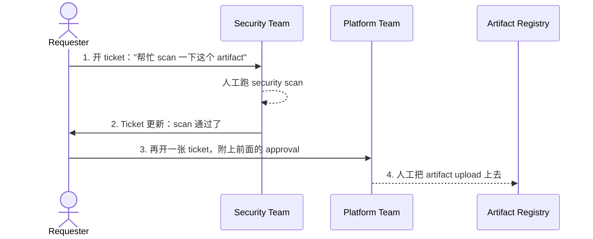
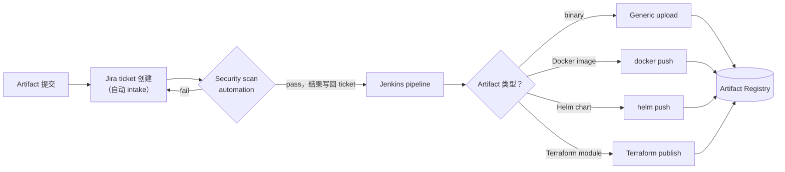

# 0.2 · 架构图

这一页就是张地图。后面每个 module 都是在填这张图里的某个 box 或者某条箭头。

## 现在的人工流程（要被取代的那个）

两张 ticket、两个 team，最后还有一个纯人工的 upload 步骤。慢，而且每次交接都是一个容易出岔子
的地方。

## 目标状态（自动化之后）

四个系统，其中三个已经独立存在了：

| 系统 | 角色 | 现状 |
|---|---|---|
| Jira | Track 请求、记录 scan 结果 | 已经接好了，能自动 trigger scanning |
| Security scan automation | Scan artifact，把 pass/fail 写回 ticket | 已经 built 好了 |
| Jenkins | 跑 upload artifact 的 pipeline | **缺的那一半**——这是要补上的部分 |
| Artifact registry（Artifactory） | 存最终的 artifact | 已经存在，只是还需要有东西 push 进去 |

这条 pipeline 里 scanning 那一半已经做完了。缺的是自动化的 **upload** 这一步——让 Jenkins
自己去接一个已经 approve 过的 artifact，直接 push 到 registry，不用人再开一张 ticket 手动做。
这也是整个网站接下来要讲的内容，尤其是 [Module 7](../module-7-capstone/7-1-option-c-mock-implementation.md)。

!!! tip "How this applies to the capstone"
    把这张图记在脑子里。Module 2-3 教你怎么搭出那个 "Jenkins pipeline" 的 box。Module 4 教你
    "Jira ticket" 那个 box 具体怎么运作、为什么不能想查就查。Module 5 教你最下面四个 artifact
    类型分支里具体是什么内容。
