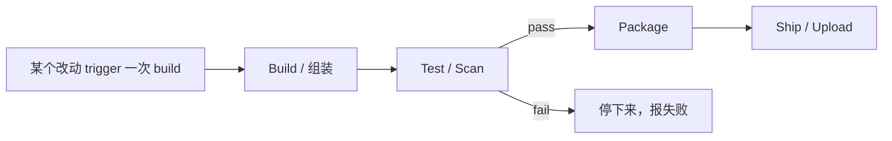

# 2.1 · 什么是 CI/CD

**Continuous Integration（CI）**：每次改动一 push 上去，就自动 build、test，不用等人手动来做。
能第一时间抓到 breakage。

**Continuous Delivery/Deployment（CD）**：一旦某个改动过了 CI，就自动打包、ship 出去（可以是
deploy，也可以是这个项目里说的 **upload 到 artifact registry**）——同样不需要人工去跑这些步骤。

## 为什么这个跟这里有关

Capstone 场景（见 [0.4](../module-0-orientation/0-4-project-requirements.md)）本质上就是个
CI/CD 问题：现在 "ship" 一个 artifact，靠的是人开两张 ticket、手动跑 upload command。这跟 CD
正好相反——是纯人工 delivery。目标是让 **upload** 这一步也自动化，跟现在 **scan** 那一步
已经做到的一样。

## 大致的样子

Jenkins 就是负责编排这整个流程的工具：真正把上面每个 box 当成一个 **stage** 按顺序跑（或者
根据结果分支）的，就是它。

## 一条好的 CI/CD pipeline 应该有的几个特点

- **Deterministic** ——同样的 input，每次都是同样的结果。
- **Fast-failing** ——便宜的检查先跑，贵的检查后跑，这样一出问题能第一时间发现。
- **不藏着人工步骤** ——如果有个人得 SSH 进去手动跑一条 command，那就还没真正自动化。
- **可 audit** ——每次跑都有 log：什么 trigger 的，什么 parameter，发生了什么。

!!! tip "How this applies to the capstone"
    Security scan 已经是 CI 的一步了（自动 trigger，自动报 pass/fail）。Upload 是那个还没
    自动化的 CD 步骤。Module 7 会把 CD 这一半搭出来：一个只在 scan 通过*之后*才跑的 stage，
    而且只在被明确要求的时候才 upload。
