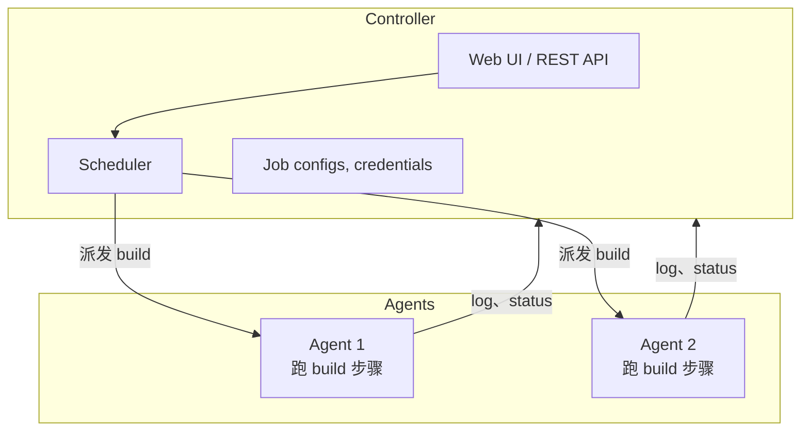

# 2.2 · Jenkins 架构

## Controller 和 agent

Jenkins 把工作拆成 **controller**（大脑：调度 job、存 config、serve 网页 UI）和一个或多个
**agent**（肌肉：真正去执行 build 的每一步）。



为什么要这么拆：不同 agent 的环境可以不一样（装的工具不一样、OS 不一样、网络访问权限不一样），
Jenkins 会挑一个跟这条 pipeline 需要的东西匹配的 agent（靠 **label** 匹配）。在 Jenkinsfile
里会长这样：

```groovy
pipeline {
    agent { label 'linux && docker' }
    // ...
}
```

## 从上到下的几个基本概念

| 概念 | 是啥 |
|---|---|
| **Job** | Jenkins 里配置好、有名字、知道怎么跑的东西。 |
| **Build** | Job 的一次执行——有编号，有状态，有 log，如果是 parameterized 的话还有这一次具体用的 parameter 值。 |
| **Pipeline** | 一次 build 会走的那套逐 stage 的逻辑，定义在 Jenkinsfile 里。 |
| **Stage** | Pipeline 里一个有名字的阶段（比如 "Scan"、"Build"、"Upload"）——在 Jenkins 的 UI 里会显示成一段。 |
| **Step** | Stage 里的一个具体动作（比如跑一条 shell command、upload 一个文件）。 |

## Config 都存在哪儿

分两个地方，改的时候得搞清楚自己改的是哪一个：

1. **Job configuration**（在 Jenkins 自己那边，通过 UI 或者它自己的 config API）——比如
   checkout 哪个 repo、什么东西 trigger 这个 job、接受哪些 parameter。
2. **Jenkinsfile**（存在被 build 的那个 repo 里）——真正的 pipeline 逻辑：stage、step、
   条件判断。为什么这部分要放在 Git 里而不是 Jenkins 的 UI 里，见
   [1.3 · GitHub 基础](../module-1-dev-environment/1-3-github-basics.md)。

!!! warning "常见坑：改错了层"
    如果 pipeline 没跑出你预期的 stage，先分清楚是 *job config*（trigger 条件、parameter）
    的问题，还是 *Jenkinsfile*（stage 逻辑）的问题——这两个是在完全不同的地方改的。

!!! tip "How this applies to the capstone"
    Capstone 场景里的 "main build" 是一个 **job**；每次跑是一个 **build**；新加的
    `push_to_artifactory` parameter（2.5）是在 job-config 那一层定义的，而对它做反应的逻辑
    写在 Jenkinsfile 里（2.4、Module 3）。
