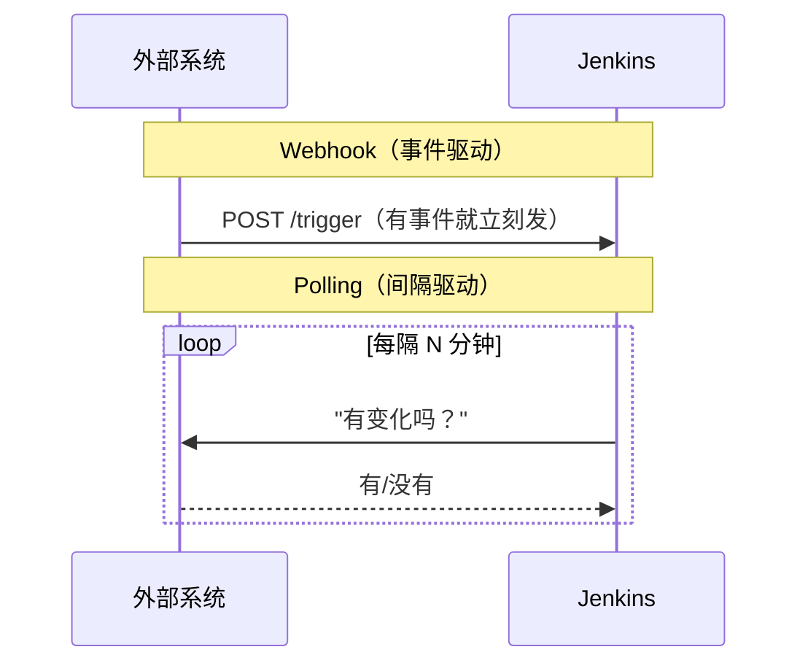

# 2.6 · Triggers

Trigger 就是导致一次 build 开始跑的原因。每个 job 至少有一个 trigger，哪怕这个 trigger
只是 "有个人点了那个按钮"。

| Trigger 类型 | 怎么工作 | 举例 |
|---|---|---|
| **手动** | 人通过 UI 或者 CLI 手动开始一次 build。 | "Build Now" 按钮。 |
| **SCM polling** | Jenkins 定期去 repo 那边检查有没有新 commit，有的话就 build。 | `pollSCM('H/5 * * * *')`——每 5 分钟查一次。 |
| **Webhook** | 外部系统在某件事发生的那一刻，直接调 Jenkins 的 HTTP endpoint——没有 polling 的延迟。 | GitHub push 会通过 webhook 立刻 trigger 一次 build。 |
| **Scheduled（cron）** | 按固定 schedule 跑，跟外部事件没关系。 | 每晚跑一次的 build。 |
| **Upstream/downstream job** | 一个 job 在自己的 pipeline 里 trigger 另一个 job。 | Parent job 调 child job——见 [2.7](2-7-parent-child-jobs.md)。 |
| **REST API trigger** | 外部系统直接 POST 到 Jenkins 的 build-trigger endpoint。 | 任何想程序化 kick off 一次 build 的系统，包括顺便传 parameter。 |

## Webhook vs. Polling

只要能用 webhook，就严格优于 polling：即时（没有 polling 的延迟），也不会浪费
Jenkins/agent 的资源，每隔几分钟去问一次 "有变化吗"，而大多数时候答案都是没有。Polling
只是给那些没法直接调 Jenkins 的系统留的一个兜底方案。



## Cron 语法速查

Jenkins cron 格式：`MINUTE HOUR DAY MONTH DAY_OF_WEEK`，外加一个 Jenkins 特有的 `H`（hash），
用来把负载分散开：

```text
H/5 * * * *      # 大约每 5 分钟一次
H 2 * * *        # 每天一次，大概凌晨 2 点左右
H 9 * * 1-5      # 每天一次，大概早上 9 点，只算工作日
```

用 `H` 而不是写死的具体数字，能让 Jenkins 把 schedule 相近的 job 分散到这一小时里，
而不是所有 job 都卡在整点 `:00` 同时挤爆。

!!! tip "How this applies to the capstone"
    现在的人工流程里（见 [0.4](../module-0-orientation/0-4-project-requirements.md)），
    upload 这一步的 trigger 字面意思就是 "有个人开了第二张 ticket"。要自动化它，要么用
    parent-job 去调（Option A，一个 upstream/downstream trigger），要么用
    build-parameter 驱动的 downstream 调用（Option C——trigger 机制一样，数据流转的方式
    不一样）。这两个方案都没有直接靠 Jira 的 polling 或 webhook，这正是
    [4.4](../module-4-jira/4-4-why-querying-is-expensive.md) 想说明的重点。
