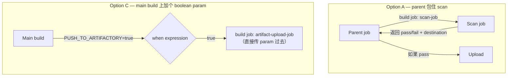

# 2.7 · Parent/Child Jobs

**Parent job** 在自己的 pipeline 里 trigger 一个 **child（downstream）job**，通常还会顺手
传一些 parameter 过去。这正是 capstone 场景里 Option A 和 Option C 背后的机制
（[0.4](../module-0-orientation/0-4-project-requirements.md)）——它们的区别在于*什么东西
trigger 了 parent*、以及*往 downstream 传了什么*，而不是这个基本机制本身。

## 从 Jenkinsfile 里 trigger 一个 downstream job

```groovy
stage('Trigger Upload') {
    when {
        expression { params.PUSH_TO_ARTIFACTORY == true }
    }
    steps {
        build job: 'artifact-upload-job',
              parameters: [
                  string(name: 'ARTIFACT_TYPE', value: params.ARTIFACT_TYPE),
                  string(name: 'ARTIFACT_PATH', value: params.ARTIFACT_PATH),
                  string(name: 'DESTINATION_PATH', value: params.DESTINATION_PATH)
              ],
              wait: true
    }
}
```

- `build job: '<job-name>'`——trigger 另一个 job 的核心 step。
- `parameters: [...]`——把值传下去；每一项的 `name` 必须跟 downstream job 实际声明的某个
  parameter 对得上（见 [2.5](2-5-build-parameters.md)）。
- `wait: true`——parent build 会一直等到 downstream job 跑完，而且它的 success/failure
  会往上传回来。`wait: false` 是发了就不管（parent 不等也不关心结果）。

## Option A vs. Option C，用这套 vocabulary 来说



- **Option A**：这个 parent job *存在的唯一理由*就是去调 scan job、然后读它的结果——scan
  job 变成了一个新 wrapper job 的 child。
- **Option C**："parent" 就是*已经存在*的那个 main build——不需要新建 wrapper job。它只是
  多了一个 conditional stage，flag 为 true 的时候调一个新的 downstream job。

Option C 需要新增的基础设施更少：一个已有的 job 多一个 parameter 加一个 conditional 的
`build job` step，而 Option A 需要一个全新的 parent job。

!!! warning "常见坑：parameter 名字对不上，不一定会报错"
    如果传的是 `parameters: [string(name: 'ARTIFACT_TYPE', ...)]`，但 downstream job
    声明的 parameter 叫 `ARTIFACT_TYPE_NAME`，Jenkins 不一定会明显报错——downstream job
    可能就悄悄用它自己的默认值跑了。传参前确认两边的 parameter 名字完全一致。

## Try it yourself

1. 在纸上（或者文本文件里）画出从 main build 传给 downstream upload job 需要的
   `parameters:` list，对应 Option C 提到的四个字段：repo 位置、binary 细节、artifact
   类型、destination path。
2. 写出对应的 `build job:` step。

!!! tip "How this applies to the capstone"
    这一页就是 Option C 里 "trigger 一个 NYI 的 downstream job" 这句话的机械实现。
    [Module 7](../module-7-capstone/7-1-option-c-mock-implementation.md) 会把这次调用
    两边的完整 Jenkinsfile 都写出来。
