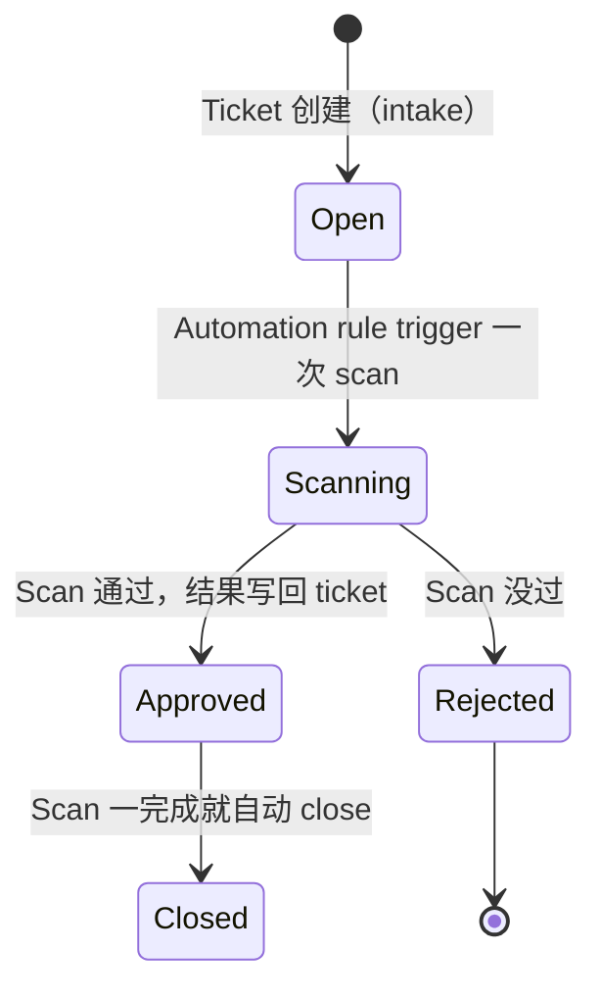

# 4.1 · Jira 基本概念

Jira 是一个 ticketing/issue-tracking 系统。在这个项目里，它是 security-scan 请求/审批流程的
system of record——不只是个待办事项清单。

## 核心概念

| Term | 意思 |
|---|---|
| **Issue / ticket** | 一个被 track 的工作单元，用一个类似 `PROJ-1234` 这样的 key 标识（project 前缀 + 编号）。 |
| **Issue type** | Ticket 的分类（比如 Task、Bug、Story）——每个 project 自己定义一套。 |
| **Status** | 这张 ticket 现在处于 workflow 里的哪个位置（比如 Open → In Progress → Done）。 |
| **Workflow** | 某个 issue type 允许的 status 转换路径——按 project 单独配置。 |
| **Field** | Ticket 上一块结构化的数据——有的是内置的（status、assignee），有的是某个 project 特意加的 **custom field**。 |
| **Transition** | 把一张 ticket 从一个 status 移到另一个 status 的动作（可以手动，也可以自动）。 |
| **Automation rule** | 一条配置好的 "X 发生的时候，做 Y" 的行为——比如 "这种类型的 ticket 一创建，就 trigger 一次 scan"。 |

## Custom fields

Jira 允许一个 project 在内置字段之外再加字段。这跟 capstone 场景直接相关：Option B
（[0.4](../module-0-orientation/0-4-project-requirements.md)）提出要加一个 custom field，
在建 ticket 的时候就填好目标 upload 位置。Custom field 跟内置字段一样，都能通过 REST API
读写——见 [4.2](4-2-jira-rest-api.md)。

## 这个项目里 ticket 的生命周期

注意 `Approved --> Closed` 这条转换——ticket 不会一直开着等某个人（或者某个 automation）
来处理这个 approval。就是这一个细节，导致 Option B 最后被否掉了；完整解释见
[4.4 · 为什么 Query 很贵](4-4-why-querying-is-expensive.md)。

!!! tip "How this applies to the capstone"
    [0.4](../module-0-orientation/0-4-project-requirements.md) 里那个 "两张 ticket 的人工
    流程"，本质上就是两个 Jira issue 加一次人工的 status 转换。自动化它，就是要把这个由人
    驱动的转换，换成一个 webhook（4.3），或者是在 intake 那一刻就把数据往前传（Option C）。
