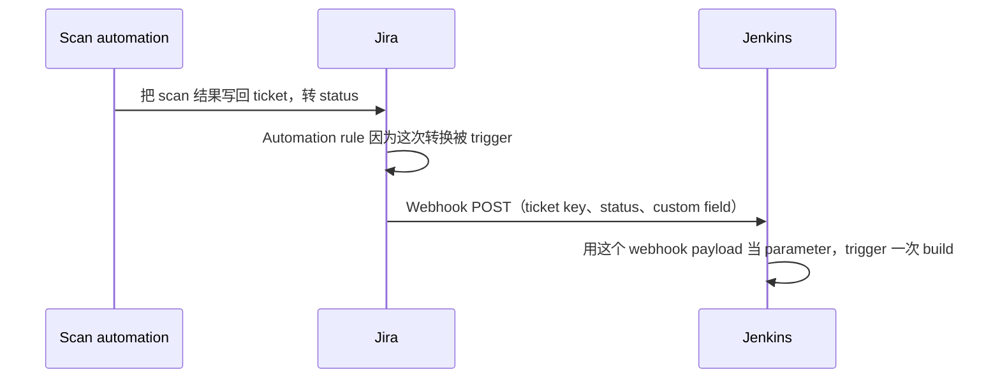

# 4.3 · Webhooks & Triggers

Webhook 是 Jira 主动往*外*调另一个系统——跟 pipeline 反过来去 poll 或者 search Jira 正好相反
（trigger 的完整分类见 [2.6 · Triggers](../module-2-cicd-jenkins/2-6-triggers.md)）。

## 怎么配置

Jira 的 automation rule 可以配成：**when**（一个 trigger 条件，比如 "issue 转到 Approved"）
**then**（一个动作，比如 "往这个 URL 发一个带这个 payload 的 web request"）。



## Webhook payload 长什么样

```json
{
  "issue": {
    "key": "PROJ-1234",
    "fields": {
      "status": { "name": "Approved" },
      "customfield_10050": "artifactory/generic-local/tools/artifact-x/"
    }
  },
  "webhookEvent": "jira:issue_updated"
}
```

最关键的一点：**接收方需要的一切，都在这一个 payload 里了**——它不需要转身再去调 Jira 的
REST API 查东西。这跟 [0.4](../module-0-orientation/0-4-project-requirements.md) 里 Option
C 那个 build parameter 设计的思路是一样的：数据在能拿到的那一刻就用掉，不要事后再回去找。

## Webhook vs. "事后再去读 ticket"

| | Webhook（事件驱动） | 事后再 Query（Option B 的思路） |
|---|---|---|
| 时机 | 即时，每个事件正好触发一次 | 取决于 querying 那边什么时候恰好去查 |
| 数据新鲜度 | 保证是事件发生那一刻的最新状态 | 等查的时候，ticket 可能已经变了（closed、重新分配了） |
| 代价 | 一次 inbound 调用，不需要搜索 | 一次 search query——见 [4.4](4-4-why-querying-is-expensive.md) |
| 失败模式 | 如果 Jenkins 当时挂了，这个 webhook 除非有重试机制，否则可能就彻底丢了 | 随时都能重新查，但那张 ticket 到时候可能已经查不到了 |

!!! warning "常见坑：webhook 不保证一定送达"
    如果接收端当时挂了或者报错，大多数 webhook 系统只会重试有限次数，然后就放弃了。别以为
    "我们有 webhook 了" 就等于 "绝对不会漏事件"——生产环境一般还需要一条
    reconciliation/兜底的路径。

## Try it yourself

1. 画一个（JSON）webhook payload，对应 capstone 场景里 "scan approved" 这个事件，
   带上一个假想的 destination-path custom field。
2. 想一下这个 payload 里的哪些字段，分别对应 [2.5](../module-2-cicd-jenkins/2-5-build-parameters.md)
   里的哪些 Jenkins build parameter。

!!! tip "How this applies to the capstone"
    Capstone 里的 Option A/B/C，其实都没有真的靠 Jira→Jenkins 的 webhook——scan
    automation 已经在 ticket 创建的时候自动 trigger 了，而 *upload* 的 trigger 是设计成
    搭在已有的 build 上（Option C），而不是需要一个全新的 Jira-to-Jenkins webhook 集成。
    这一页存在的意义，是让你以后遇到这个模式的时候能认出来。
