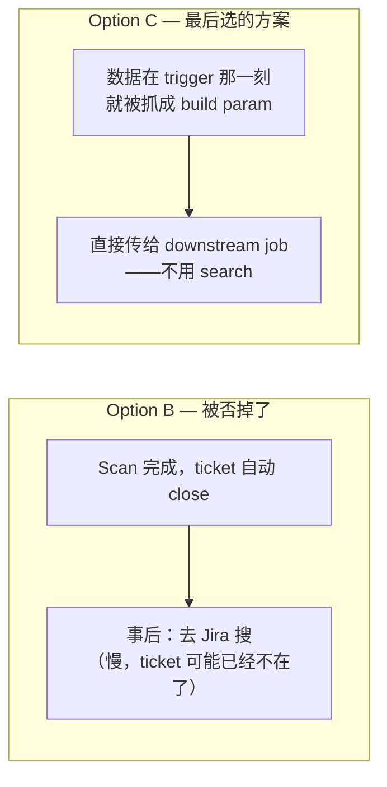

# 4.4 · 为什么 Query 很贵

这一页解释一下 capstone 场景里 Option B（
["事后加个字段，回头再去读"](../module-0-orientation/0-4-project-requirements.md#option-b-extra-intake-field-on-the-ticket)）
被否掉的具体技术原因。值得深究一下，因为 "直接去 Jira 查一下答案不就行了" 是最直觉的第一
反应，而它失败的原因，其实可以推广到这一个项目之外。

## 原因一：Search 很慢，哪怕啥都没搜到

Jira 的 search endpoint（JQL——见 [4.2](4-2-jira-rest-api.md)）要跑一遍 query，对着
ticket 的 index 去算——具体多慢取决于 instance 规模、query 写得复杂不复杂（有没有查未建
index 的字段、时间范围是不是太宽、有没有对 custom field 做 `ORDER BY`），可能是几秒钟，
不是几毫秒。关键是：**这个代价，哪怕 query 一个都没匹配上，也照样得付**——搜*某个东西*、
结果啥都没搜到，这件事本身不是免费的。在这个项目的实际数字里，一个 0 匹配的 job 照样要跑
超过 5 分钟。

如果一条 upload pipeline 每次都要重新跑一遍 search，去问 "刚刚有没有哪张 ticket 被
approve 了"，那这个代价是每次 build 都要重复付一遍——而绝大多数时候啥都搜不到，因为大多数
build 都不是刚好赶上某张 ticket 被 approve 的那一次。

这其实是精益生产（lean manufacturing）里经典的**八大浪费（mudas）**之一：
**overprocessing**——做了比这个任务实际需要更多的工作。触发事件本身*已经*带着需要的信息了，
却还要在每次 build 上重新跑一遍昂贵的 search，纯属 overprocessing。

## 原因二：那张 ticket 可能已经不在那儿等你搜了

Scan automation 一跑完，就会**自动把 ticket close 掉**（见 [4.1](4-1-jira-concepts.md)
里的生命周期图：`Approved → Closed` 是自动发生的，中间没有任何人或者 downstream
automation 插手）。

这一点很关键，因为：

- Closed 的 ticket 经常会被默认/常见的 search scope 排除在外。
- 就算技术上还能查到，"找刚被 close 的那张 ticket" 本身是场竞速：等 downstream 流程真正
  去搜的时候，close 这个转换可能已经发生了，而这会改变哪些字段算 "当前值"，或者这张
  ticket 在 JQL 结果里怎么显示。

简单说：**这张 ticket 真正处于你需要的那个状态、还能可靠地被拿到需要的信息的那个窗口，
本来就很短，而且不保证等你去查的时候还开着。**

## 设计上的结论

这两个问题指向同一个解法：**别在事后去搜数据——在数据能拿到的那一刻就抓下来，往前带着走。**
这正是 Option C 在做的事：destination path 和 artifact 细节，*在 main build 跑起来的那一刻*
就被当成 build parameter 附上去，downstream upload job 直接收到
（[2.7 · Parent/Child Jobs](../module-2-cicd-jenkins/2-7-parent-child-jobs.md)）——不需要
search，不用跟 auto-close 赛跑，也没有每次 build 都要付的 overprocessing 代价。

!!! warning "常见坑：以为一张已经 close 的 ticket 还是能随便读的"
    对着一个已知的 key 直接 `GET /issue/{key}`，close 之后通常还是能读——真正的问题是
    "事后**搜出来**找到这个 key"，而不是拿着一个已知 key 去读它。如果你手上已经有这个
    key 了，读它很便宜；真正贵、真正不靠谱的，是 Option B 依赖的那个 search 步骤。

!!! tip "How this applies to the capstone"
    这是 capstone 最后选定架构这个决策背后，最重要的一段推理。如果被问到为什么 Option C
    比 Option B 好，答案就在这一页：overprocessing 的代价 + close 造成的竞速问题，
    Option C 靠 "把数据往前抓" 而不是 "事后往回查"，把这两个问题一起消掉了。
