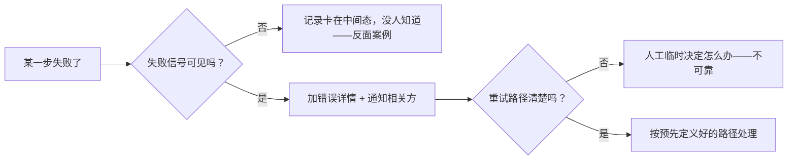

# 6.4 · 跨系统集成设计原则

这一页跟具体工具没关系，讲的是更通用的一层：**两个各自独立的自动化系统（不同 team、不同
codebase）要对接的时候**，有哪些设计上的坑是反复出现的。这些原则不是这个网站特有的，
放在任何 distributed system 的集成场景里都成立。

## 原则一：传一个 reference，还是传完整的数据？

两个系统交接的时候，上游可以选择：

- **传一个 reference**（比如一个 ID）——下游自己去查完整数据。
- **传完整的 payload**——上游把下游需要的一切都打包好，直接给。

| | 传 reference | 传完整 payload |
|---|---|---|
| 优点 | 下游拿到的永远是最新数据；上游不需要提前知道下游 schema 的所有细节 | 不需要额外的一次 lookup；下游不用依赖上游的数据源还活着 |
| 缺点 | 下游多一次 lookup 的成本和失败可能性；依赖那个数据源在下游处理的时候还能查到 | 一旦上下游的数据 schema 不同步，payload 就可能过期或者不完整 |
| 什么时候选哪个 | 数据源稳定、查询便宜、而且下游总能拿到最新状态的时候 | 数据源查询贵、或者有效期短（比如即将被归档/清理）的时候 |

这不是非黑即白——很多真实系统会两个都做一点：传一个 reference，**外加**几个下游必须马上
知道、不该临时查的关键字段（比如决定走哪条分支的 type 字段）。到底该传多少，取决于这个
数据源的查询成本和数据新鲜度要求——这跟 [4.4 · 为什么 Query 很贵](../module-4-jira/4-4-why-querying-is-expensive.md)
里讨论的是同一类权衡，只是这里更通用。

## 原则二：谁最终拥有"这件事做完了"的判断权？

如果一个共享的记录（一张 ticket、一行 DB 记录、一个 job 的状态）要经过好几个系统接力处理，
那么**只有最后一棒的那个系统，才有资格把它标记成"完成"**。如果中间某个系统提前把它标记成
"done"，而后面还有步骤没跑完，就会出现两种典型问题：

- 后面的步骤失败了，但没人知道，因为记录已经显示"完成"了。
- 后面的步骤压根没被 trigger，因为触发条件是"记录还没被标记完成"。

**设计上的做法**：明确定义好每一段接力棒的"完成"信号是什么，只有真正拥有最后一步的系统，
才拥有把整条记录标记成 terminal state 的权限。

## 原则三：失败路径要显式设计，不能是隐性的人工兜底

"如果失败了怎么办"不能是一个事后才想起来问的问题。一个好的失败路径应该：

1. **让失败状态可见**——比如给记录加一条带错误详情的注释/log，而不是让它悄悄卡在某个中间态。
2. **主动通知，而不是等人发现**——失败了应该推一条通知（邮件、chat message），不能指望有人
   没事就去翻一遍所有记录，看看有没有卡住的。
3. **明确重试路径**——失败之后，是自动重试、还是需要人工触发重跑？这个答案应该写在设计里，
   不是等第一次真出问题了才现场讨论。

## 原则四：显式的 metadata 优于下游去猜/去推断

如果一个请求本身带着"类型"这种分类信息，最好的做法是**在最上游、数据产生的那一刻，就让
它显式带上这个标签**，而不是让下游系统靠文件后缀、内容特征之类的线索去猜。

- 显式标签的好处：下游逻辑简单、可预测，新增一种类型的时候容易扩展。
- 靠猜的坏处：猜错了不容易发现（可能悄悄按错误类型处理，而不是报错），而且每次上游新增
  一种变体，下游猜测逻辑都要跟着改。

这跟 [3.1](../module-3-groovy-jenkinsfile/3-1-groovy-basics.md) 和
[7.2](../module-7-capstone/7-2-downstream-job-branching.md) 里那种"未知类型必须显式报错，
不能默默放过"的 fail-fast 思路是一致的——先在源头把分类做对，比事后在下游修修补补猜测逻辑
成本低得多。

## 原则五：别把临时状态持久化在执行环境本身里

CI 的 build agent、临时的计算环境，理想情况下应该是无状态、随时可以被丢弃重建的。如果一个
流程需要在多个步骤之间传递比较大的临时数据（文件、二进制内容），更稳妥的做法是把它存在一个
双方都能访问的**系统记录**里（数据库、对象存储、消息里的附件），下游需要的时候自己去取，
而不是直接把原始数据在执行环境之间传来传去。

好处：

- 执行环境可以随时被清空/重建，不用担心"这个 agent 上还留着没处理完的数据"。
- 如果某一步重跑，能拿到跟第一次完全一样的输入，而不是依赖一个可能已经不存在的临时文件。

!!! warning "常见坑：图省事，把这几条原则都跳过了"
    这几条原则在系统还小、只有一两个人维护的时候，看起来都像是"过度设计"——直接传完整数据、
    谁先跑完谁标记完成、失败了群里喊一声就行。问题是系统会变大、团队会换人，这些隐性的默契
    早晚会因为没人记得而失效。提前把这几条写清楚，成本远比出了问题之后再排查低。

!!! tip "How this applies to the capstone"
    这五条原则跟具体用什么工具没关系，但每一条都能在这个网站的其他 module 里找到对应的
    具体实现：原则一对应 [4.4](../module-4-jira/4-4-why-querying-is-expensive.md) 里
    reference vs. payload 的取舍；原则三、四对应
    [7.2](../module-7-capstone/7-2-downstream-job-branching.md) 和
    [7.3](../module-7-capstone/7-3-debug-scenarios.md) 里显式报错和失败排查的写法。
